# Local Notification Manager 🚀

Welcome to **Local Notification Manager**, a React Native app demonstrating local notification handling with different scenarios and user interactions.

---

## 📌 Features Overview

🔔 **Notification Setup**

- Implements React Native local notifications.
- Handles foreground and background app states.
- Proper permission handling for notifications.
- Supports both iOS and Android.

⏰ **Scheduled Notifications**

Users can schedule reminders with:

- Title & message
- Date & time selection
- Repeat options (Once, Daily, Weekly)
- List of scheduled notifications.
- Allows editing and canceling notifications.

## 🎥 Demo Video

<div style="display: flex; flex-direction: 'row';">
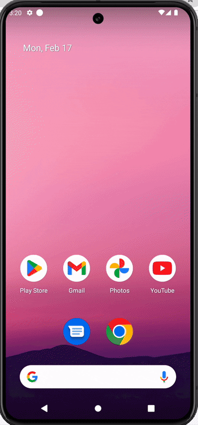

## Screenshots

<div style="display: flex; flex-direction: 'row';">
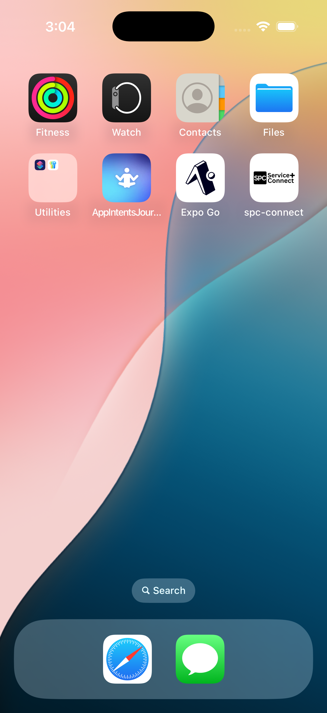

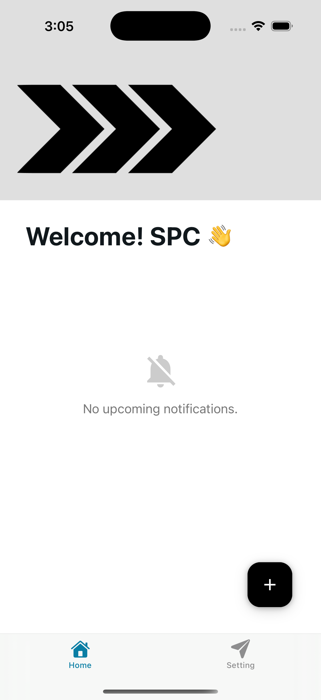
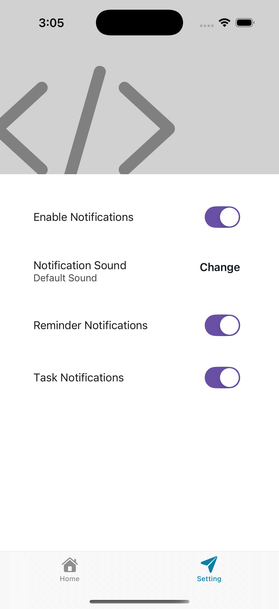
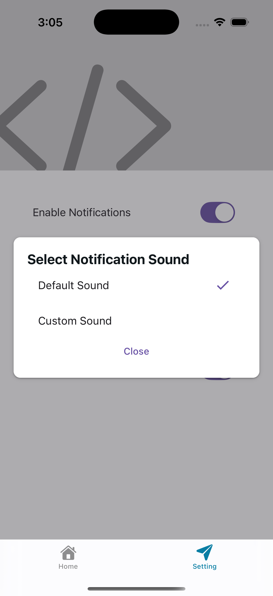
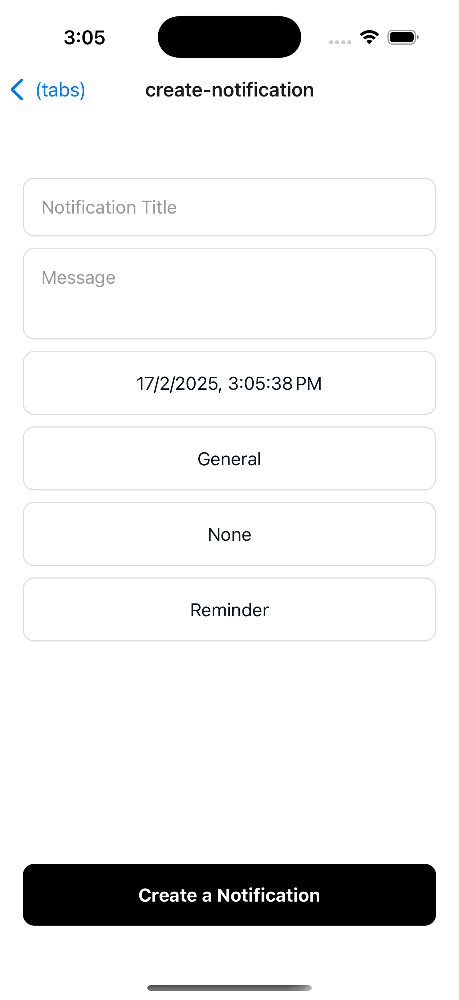
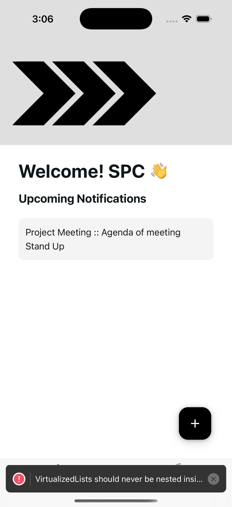
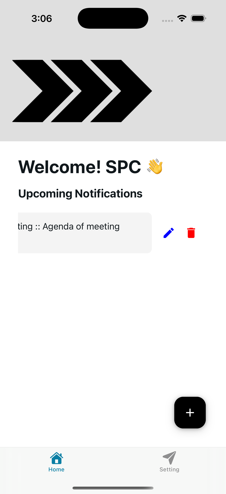
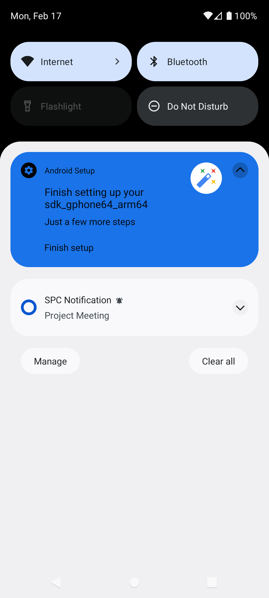
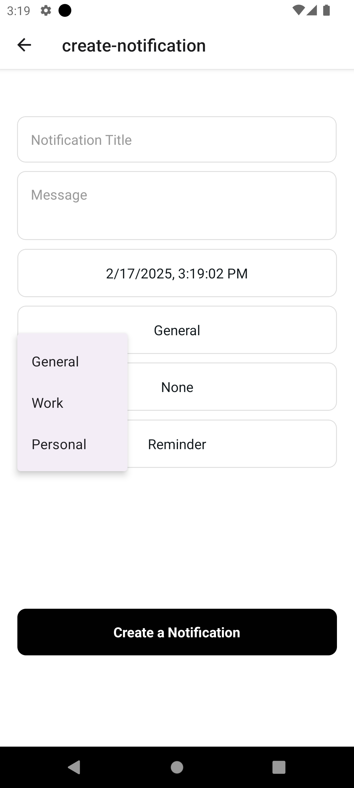
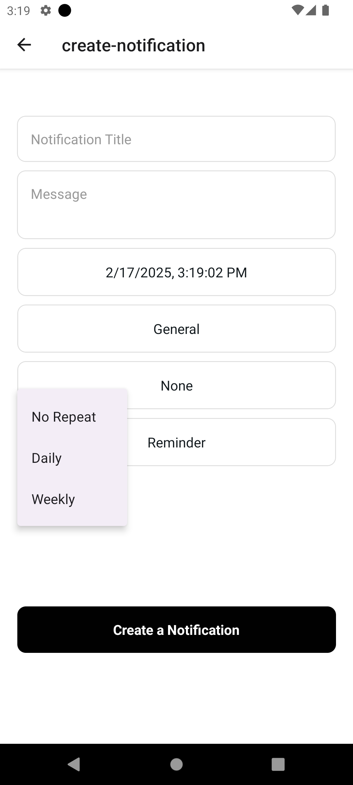
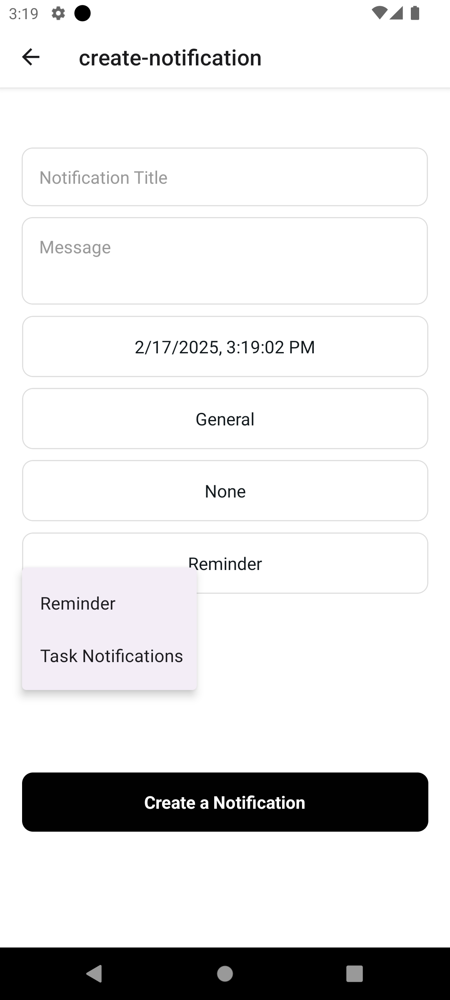

</div>

---

## Get Started

### 1. Clone the repository

```bash
git clone <repository-url>
```

### 2. Install dependencies

```bash
npm install
```

### 3. Start the app

```bash
npx expo start
```

**This will launch the app on:**

- iOS Simulator 📱
- Android Emulator 🤖

This command will provide options to run the app in:

- A [development build](https://docs.expo.dev/develop/development-builds/introduction/)
- [Android emulator](https://docs.expo.dev/workflow/android-studio-emulator/)
- [iOS simulator](https://docs.expo.dev/workflow/ios-simulator/)
- [Expo Go](https://expo.dev/go) for testing in a limited sandbox environment

---

**🔧 Libraries Used**

- `@notifee/react-native` - Local notification management.
- `react-navigation` - Navigation between screens.
- `@react-native-async-storage/async-storage` - Data persistence.
- `@react-native-picker/picker` - Category & repeat selection.
- `@react-native-community/datetimepicker` - Date & time selection.
- `react-native-paper` - UI components & menus.

## Learn More

To dive deeper into the project or Expo framework, check out these resources:

- [Expo Documentation](https://docs.expo.dev/): Learn the fundamentals or explore advanced topics with [guides](https://docs.expo.dev/guides).
- [Learn Expo Tutorial](https://docs.expo.dev/tutorial/introduction/): Follow a step-by-step guide to build a project that runs on Android, iOS, and web.

---

## Feedback

We'd love to hear from you! Share your feedback or reviews:

- On [GitHub](https://github.com/hellochirag)
- On [LinkedIn](https://www.linkedin.com/in/chiragjadav/)
- Via email at [chiragjadav134@gmail.com](mailto:chiragjadav134@gmail.com)

---

**Note:**
When testing notifications in the iOS simulator, please note that they require a real device to function properly. To run on a real device, you will need to configure the necessary certificates and provisioning profiles.

This task is intended for understanding and knowledge-checking purposes, and I may not have covered all aspects here. If you need any clarification or further details, feel free to reach out to me.

Thank you!

---

Let’s build something amazing together! 🚀
